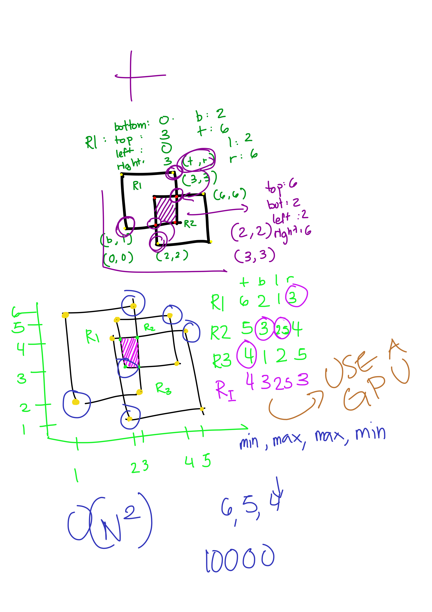

# Algolympics 2021 Practice Problem Solution
 My personal solution(s) for the Algolympics 2021 Practice Problem.

## References

* [Algolympics 2021 Practice Problem](https://drive.google.com/file/d/1NK-m6ycSIIXCtGKuDI2qAasVrMsTrayH/view)
* https://stackoverflow.com/questions/19753134/get-the-points-of-intersection-from-2-rectangles
* https://www.baeldung.com/string/split
* https://stackoverflow.com/questions/3481828/how-to-split-a-string-in-java
* https://careerkarma.com/blog/java-initialize-array/
* https://mkyong.com/java8/java-8-streams-map-examples/
* https://stackoverflow.com/questions/2279030/type-list-vs-type-arraylist-in-java
* https://stackoverflow.com/questions/1480663/how-can-i-slice-an-arraylist-out-of-an-arraylist-in-java/1481123#1481123
* https://stackoverflow.com/questions/737244/java-map-a-list-of-objects-to-a-list-with-values-of-their-property-attributes
* https://stackoverflow.com/questions/27345834/splitting-and-converting-string-to-int
* https://beginnersbook.com/2013/12/how-to-initialize-an-arraylist/
* https://stackoverflow.com/questions/5821546/java-secondary-not-public-class-usage-produces-error-type-is-not-visible-even
* https://www.w3schools.com/java/java_type_casting.asp
* https://www.dummies.com/education/math/pre-algebra/how-to-determine-the-area-of-compound-rectangles/
* https://alvinalexander.com/java/how-to-sum-elements-in-java-list-arraylist-linkedlist-method/#:~:text=I%20define%20a%20sum%20method,sum(ints)%3B
* https://stackoverflow.com/questions/5963847/is-there-possibility-of-sum-of-arraylist-without-looping
* https://stackoverflow.com/questions/5319754/cross-reference-named-anchor-in-markdown

## Index

Draft of Solution

